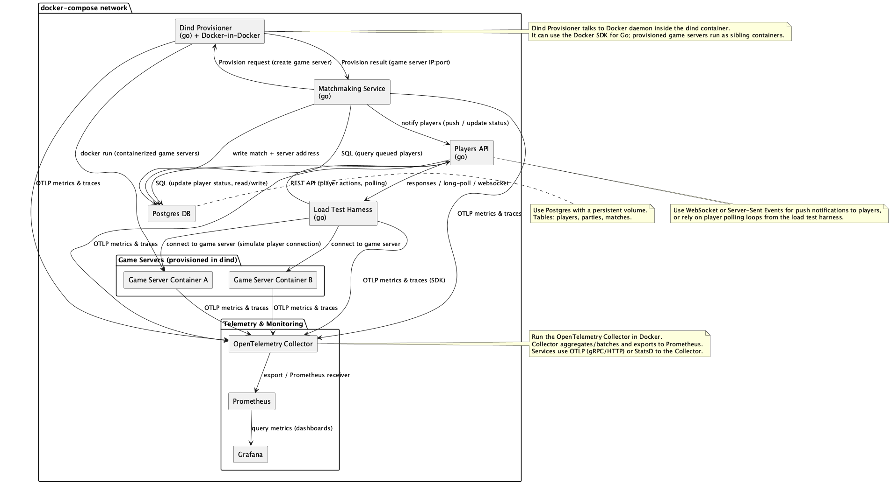

# Scalable Matchmaking System Simulation

[](https://golang.org/)
[](https://www.docker.com/)
[](https://redis.io/)
[](https://prometheus.io/)

**A high-performance simulation of a competitive matchmaking architecture, engineered in Go.**
This project tries to model the backend systems of multiplayer online games like Valorant. It demonstrates advanced concurrency patterns, distributed system design, and dynamic container orchestration.

---

## System Architecture

The system is designed as a set of microservices communicating via REST and WebSockets, orchestrated by Docker Compose. It simulates the full lifecycle of a player: logging in, queuing for a match, being matched, and connecting to a dynamically provisioned game server.



## Key Engineering Features

### 1. High-Fidelity Load Generation ("The Harness")
Unlike simple load testing scripts, the **Harness** mimics realistic user behavior using a **Compositor** pattern.
- **Statistical Modeling:** Instead of tight loops, it calculates execution rates per second to simulate "thundering herds" or steady-state traffic.
- **Concurrency:** Manages thousands of persistent `Player` goroutines. Each player maintains its own session state, mimics client-side latency, and executes scenarios (e.g., `JoinQueue`, `PurchaseItem`) based on probabilistic distribution.

### 2. Distributed Matchmaking Logic
The matchmaking service handles the core logic of grouping players.
- **Atomic Operations:** Utilizes **Redis Lua scripts** to atomically pop batches of players from the queue, ensuring no player is matched twice.
- **Worker Pattern:** Background workers poll Redis lists, process player tickets (FIFO), and interface with the orchestration layer to request server resources.

### 3. Dynamic Infrastructure Provisioning (DinD)
The **Game Orchestrator** service runs in privileged mode to interact with the host Docker socket.
- **On-Demand Scaling:** When a match is formed, the Orchestrator uses the Docker API to spin up a lightweight, ephemeral **Game Server** container specifically for that match.
- **Proxying:** The Orchestrator acts as a reverse proxy, routing WebSocket connections from players to their specific ephemeral game server container, abstracting the dynamic IP/Port details from the client.

### 4. Observability & Metrics
The system is built with "Observability First" principles.
- **Instrumentation:** Every service (Gateway, Matchmaker, Orchestrator) exposes a `/metrics` endpoint.
- **Visualization:** A **Prometheus + Grafana** stack visualizes real-time data, including:
  - Queue depth and wait times.
  - Match formation rates.
  - Active game server count.
  - Go runtime metrics (GC pauses, goroutine count).

## Technology Stack

*   **Language:** Go  - Chosen for its CSP concurrency model (Goroutines/Channels) and raw performance.
*   **Data Store:** Redis - Used for high-speed volatile state (Queues, Tickets, Sessions).
*   **Containerization:** Docker & Docker Compose - For reproducible environments and service mesh networking.
*   **Infrastructure:** Docker-in-Docker (DinD) - For simulating cloud provider instance provisioning.
*   **Communication:**
    *   **REST (HTTP/1.1):** Service-to-service control plane as well as simple client-to-backend interactions.
    *   **WebSockets:** Real-time client-server communication for game simulation.

## Performance Tuning
- Docker and Go resource-limitations (e.g. `GOMAXPROCS`) are used to simulate deployment on real distributed environments.

## Getting Started

### Prerequisites
- Docker Engine & Docker Compose

### Running the Simulation

1. **Start the Infrastructure:**
   ```bash
   docker-compose up -d --build
   ```

2. **Access Dashboards:**
   - **Grafana:** `http://localhost:3000/dashboards` (Visualize the queue and server load)
   - **Prometheus:** `http://localhost:9090`

3. **Scale the Load:**
   Modify the `target_players` environment variable in `docker-compose.yml` to increase the concurrency of the Harness.

## Inspiration
This project was inspired by Riot Games' article on [Scalability and Load Testing for Valorant](https://technology.riotgames.com/news/scalability-and-load-testing-valorant), aiming to replicate the architectural complexities of shipping a global-scale competitive game.

## Disclaimer
Since the main focus for this project was the architectural challenge, alot of code and documentation was written using ai